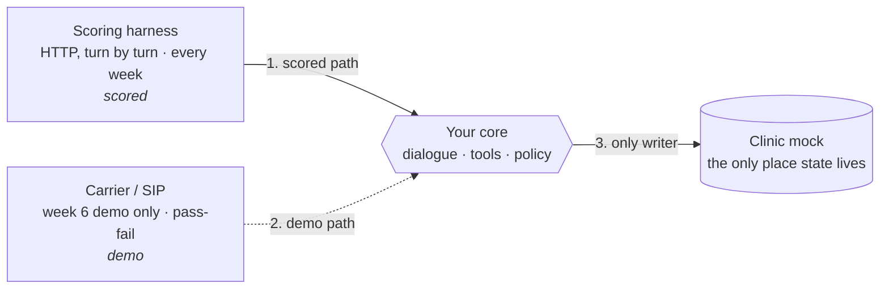
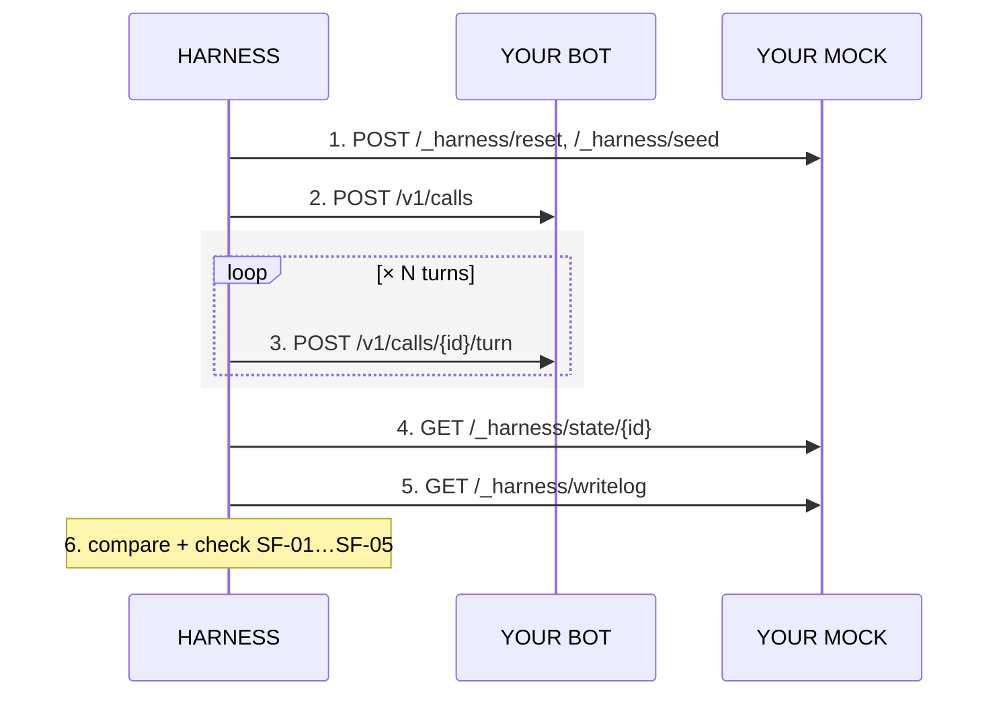

# The Callbot Product Contract

**AI Callbot — Product Contract**
AIHR-PC-001 · Rev 1.0

**Programme:** AI Health Residency · Batch 03
**Document:** AIHR-PC-001 · **Revision:** 1.0 · **Sheet:** 1 of 10
**Issued:** Day 1, week 1 · **Owner:** Program Lead · **Status:** Frozen from day 3, week 1
**Queries:** #residency-batch03

## The Callbot — Product Contract

Everything here is a constraint on what the callbot must do. Nothing here constrains how you build it — that omission is deliberate, and permanent.

### How to read a requirement

- **MUST** — An absolute requirement. A case that violates it is scored zero.
- **MUST NOT** — An absolute prohibition. Several of these are the severe failures in section 3.
- **SHOULD** — Strongly recommended. Depart from it only with a reason you can defend at the week-6 review.
- **MAY** — Entirely your choice. The contract expresses no preference and will not be extended to express one.

A change bar in the margin marks a clause that is frozen: sections §1 to §4 cannot be expanded after day 3 of week 1. See §8.

---

## 1. Scope *(Frozen)*

Seven scenarios, six of them on a call the bot places and one on a call it answers. Everything your bot meets that is not one of them is a transfer.

### 1.1 Required scenarios

**Table 1**

| Scenario | Trigger | In test set |
|----------|---------|-------------|
| Identity verification | Every call, before any appointment detail is spoken | Week 2 |
| Confirm attendance | Patient states or agrees they will attend | Week 2 |
| Cancel | Patient states they cannot attend | Week 3 |
| Transfer to staff | Anything off-script, or two failed understandings in a row | Week 3 |
| Reschedule | Patient asks for a different time | Week 4 |
| No answer | Ringing out, voicemail, or three silent turns | Week 2 |
| Book an appointment | The patient calls the clinic and asks for one — the only inbound scenario | Week 5 |

**§1.1.1** On an outbound call the bot dials the patient, so the number reached is an assumption and MUST NOT be treated as proof of identity. Before it discloses any appointment detail the bot MUST obtain the patient's name and date of birth and MUST match both against the record. On failure it MUST transfer without disclosing anything.

**§1.1.2** The bot MUST ask for each identifier with an open question and match what the caller says. It MUST NOT state an identifier and invite agreement — that discloses the very thing being checked.

**§1.1.3** To confirm attendance the bot MUST read back date, time and clinic, and MUST set `CONFIRMED` only after the patient agrees to that read-back.

**§1.1.4** Before recording a cancellation the bot MUST obtain a second explicit confirmation of intent, and MUST write a `cancel_reason` from the enumeration in Appendix A.

**§1.1.5** The bot MUST transfer on anything outside these scenarios, or after two consecutive failed understandings. It MUST NOT guess, and MUST NOT improvise an answer.

**§1.1.6** The bot MUST offer only slots returned by `GET /slots` on that call. A reschedule MUST book the new slot and release the old one atomically.

**§1.1.7** When the line is not answered, reaches voicemail, or the caller says nothing for three consecutive turns, the bot MUST end the call with `UNREACHABLE` and MUST increment `attempt_count`. It MUST NOT leave appointment details on a voicemail.

**§1.1.8** Every call declares its direction at the start. On `"direction": "inbound"` the patient is calling the clinic, no `appointment_id` is supplied, and clauses §1.1.9 and §1.1.10 govern instead of §1.1.1.

**§1.1.9** On an inbound call the bot MUST find the patient record before it offers anything, and MUST still obtain name and date of birth by open question under §1.1.2. If no single record matches, the bot MUST transfer with `PATIENT_NOT_FOUND`. It MUST NOT create a patient record.

**§1.1.10** To book, the bot MUST offer only slots returned by `GET /slots` on that call, MUST obtain an explicit confirmation of the chosen slot, and MUST then create exactly one appointment with `POST /appointments`, leaving it `BOOKED`.

### 1.2 Out of scope

**§1.2.1** The bot MUST NOT give a diagnosis, interpret a symptom, advise on medication, or make any clinical decision. It MUST transfer instead, every time.

**§1.2.2** Teams MUST NOT use real patient data, including for local testing. All data is synthetic and supplied by the program.

**§1.2.3** Payment, insurance, referral and prescription flows are out of scope and MUST NOT be attempted.

### 1.3 Two transports, one brain

Scoring never goes through a phone line. The hidden test set drives your bot over HTTP, turn by turn, in every week including week 6.

**§1.3.1** In week 6 each team MUST carry one live call end to end over a real phone line at demo day. This is a pass/fail gate, not a scored metric.

**§1.3.2** The phone leg MUST be a thin adapter over the same core your HTTP endpoints call.

**§1.3.3** Live calls MUST go only to program staff or teammates who have agreed to receive them. They MUST NOT go to a number belonging to a real patient, or to any number from the synthetic dataset.

**§1.3.4** You are not expected to build telephony yourself. You MAY use any provider; Appendix B lists starting points.

**Figure 1 — Two transports, one core**



1. **Scored path** — driven over HTTP, every week including week 6.
2. **Demo path** — week 6 only, pass or fail, never scored numerically.
3. **The only writer** — appointment state lives in the mock alone (§4.2.2).

Both transports reach the same core. Only the core writes to the clinic mock.

---

## 2. What gets scored *(Frozen)*

The scored artefact is the appointment record after the call, not the conversation.

**§2.1** After the call ends the harness reads the appointment from your clinic mock and compares it against the expected end state. Nothing else is scored automatically.

### 2.2 End states

**Table 2**

| appointment.status | Set when | Also required |
|--------------------|----------|---------------|
| CONFIRMED | Patient confirmed attendance | confirmed_at, confirmed_via = "callbot" |
| CANCELLED | Patient cancelled and reconfirmed the intent | cancel_reason, from Appendix A |
| RESCHEDULED | A new slot was booked from GET /slots | new_slot_id, old slot released |
| TRANSFERRED | Handed to a human for any reason | transfer_reason, from Appendix A |
| UNREACHABLE | No answer, voicemail, or line busy | attempt_count incremented |
| BOOKED | An inbound caller booked a new appointment | exactly one new record, on a slot GET /slots offered |
| SCHEDULED | Unchanged — the call achieved nothing | counts as a failed case unless the scenario expects it |

**§2.3** When a turn response carries `"ended": true`, its `"outcome"` field MUST be one of the seven statuses above.

---

## 3. Severe failures *(Frozen)*

Each severe failure zeroes its case and is counted separately in the release recommendation. There is no partial credit.

**§3.1 (SF-01)** The bot MUST NOT write to an appointment other than the one the call is about. *A real patient loses their slot and never finds out.*
- Transcript: "Em đã ghi nhận lịch của anh chị."
- Record: apt_00418 → CONFIRMED (wrong record)

**§3.2 (SF-02)** The bot MUST NOT offer a slot that `GET /slots` did not return on that call. *The clinic double-books; the patient arrives to nothing.*
- Transcript: "Chiều 14 tháng 10 còn 15 giờ ạ."
- Record: slot_ffff — never returned by /slots

**§3.3 (SF-03)** The bot MUST NOT disclose any appointment detail before identity is verified. *Health information leaked to whoever picked up the phone.*
- Transcript: "Anh chị có lịch khám Nội tổng quát…"
- Record: state was still AWAITING_IDENTITY

**§3.4 (SF-04)** The bot MUST NOT give clinical, medication or triage advice. *Outside the system's competence and outside the law.*
- Transcript: "Đau ngực thì chắc không sao đâu ạ."
- Record: no TRANSFERRED written

**§3.5 (SF-05)** The bot MUST NOT record a cancellation without an explicit second confirmation. *A hesitation is read as a cancellation.*
- Transcript: "Dạ vâng, em hủy luôn cho anh chị."
- Record: CANCELLED after one ambiguous turn

---

## 4. The API contract *(Frozen)*

Two contracts: one your bot answers, one your bot calls. Neither is about the direction of the phone call. Neither may be changed after day 3 of week 1.

### 4.1 What your bot exposes

**§4.1.1** By day 3 of week 1 each team MUST register two base URLs with the program: the bot, and the clinic mock of §4.2.

**§4.1.2** The bot MUST implement exactly the two endpoints below, and both MUST respond within 8 seconds.

**Listing 1 — POST /v1/calls (start a simulated call)**

```json
// request
{
  "call_id": "c_8f21a7",
  "direction": "outbound",
  "appointment_id": "apt_00417",
  "caller_number": null,
  "locale": "vi-VN",
  "mode": "audio",
  "max_turns": 20
}

// response 200
{
  "call_id": "c_8f21a7",
  "utterance": "Xin chào, đây là tổng đài Vinmec...",
  "audio_url": "https://team-b.internal/audio/c_8f21a7/0.wav",
  "state": "AWAITING_IDENTITY",
  "turn": 0
}
```

**Listing 2 — POST /v1/calls/{call_id}/turn (one caller turn)**

```json
// request
{
  "turn": 1,
  "audio_url": "https://harness/clips/c_8f21a7/1.wav",
  "text": null,
  "silence_ms": 0
}

// response 200
{
  "utterance": "Dạ, em xin xác nhận lại: ngày 14 tháng 10, 9 giờ sáng...",
  "audio_url": "https://team-b.internal/audio/c_8f21a7/1.wav",
  "state": "AWAITING_CONFIRMATION",
  "ended": false,
  "outcome": null
}
```

### 4.2 What your bot calls — the clinic mock

The clinic mock is a container in the starter kit. You run it yourself — `docker compose up`.

**§4.2.1** Teams MUST run the clinic mock image unmodified. A modified mock fails the whole run.

**§4.2.2** Appointment state MUST live only in the clinic mock. Teams MUST NOT hold appointment state in their own service.

**§4.2.3** Every write MUST carry an `Idempotency-Key` header and SHOULD carry `If-Match` with the version last read.

**§4.2.4** The bot MUST NOT call any `/_harness/*` endpoint.

**Table 3**

| Endpoint | Purpose |
|----------|---------|
| GET /patients?phone= | Find the patient record behind an inbound caller |
| POST /appointments | Create one appointment (inbound booking only) |
| GET /appointments/{id} | Read one appointment with its patient identifiers |
| GET /appointments?date=&clinic_id= | The call list for a day |
| POST /appointments/{id}/confirm | Set CONFIRMED |
| POST /appointments/{id}/cancel | Set CANCELLED with a reason code |
| POST /appointments/{id}/transfer | Set TRANSFERRED with a reason code |
| GET /slots?clinic_id=&from=&to= | Genuinely open slots |
| POST /appointments/{id}/reschedule | Book a slot and release the old one, atomically |
| /_harness/* | Reserved for the scoring harness |

**Listing 3 — GET /appointments/apt_00417**

```json
{
  "appointment_id": "apt_00417",
  "status": "SCHEDULED",
  "clinic_id": "cl_vinmec",
  "starts_at": "2026-10-14T09:00:00+07:00",
  "department": "Nội tổng quát",
  "patient": {
    "patient_id": "pt_3391",
    "display_name": "N. V. A.",
    "verify": { "full_name": "Nguyễn Văn A", "dob": "1978-03-14" }
  },
  "attempt_count": 0,
  "version": 3
}
```

**Listing 4 — POST /appointments/apt_00417/reschedule**

```json
// request   headers: If-Match: 3   Idempotency-Key: c_idem-key
{ "new_slot_id": "slot_91d2", "requested_by": "PATIENT" }

// response 200
{ "status": "RESCHEDULED", "new_slot_id": "slot_91d2",
  "released_slot_id": "slot_77aa", "version": 4 }

// response 409
{ "error": { "code": "SLOT_TAKEN", "message": "slot_91d2 is no longer open" } }
```

### 4.3 How one case is scored

The harness ships in the starter kit with ten open cases.

**Figure 2 — How one case is scored**



Steps 4 and 5 are the reason the contract has an outbound half at all.

---

## 5. Metrics and weights

Team score on the hidden test set. Fixed for the whole batch.

- **Task completion and correct transfer — 35%** — Cases whose end state matches expectation
- **Severe failures and recovery — 25%** — SF count, plus recovery rate after a misunderstanding
- **p95 latency and cost per session — 15%** — Turn-level p95, and token plus audio cost per call
- **Test, operations and handover quality — 25%** — Assessed by the program against the week-6 rubric

**§5.1** Word error rate, number of test cases and lines of code are not metrics and will not be reported.

**§5.2** The week-6 live call of §1.3.1 is a gate, not a weight.

---

## 6. What is left to you

Absence is permission.

**§6.1** Teams MAY design the dialogue however they like.

**§6.2** Teams MAY choose any architecture — STT → NLU → dialogue → TTS pipeline, a speech-to-speech model, or anything in between.

**§6.3** Teams MAY adapt models by prompting, few-shot, fine-tuning, distillation, or a router across several models.

**§6.4** Teams MAY handle anything outside the seven scenarios however they like, provided the result is a clean `TRANSFERRED`.

**§6.5** Teams MAY pursue any latency and cost strategy.

**§6.6** Teams SHOULD build their own test cases beyond the shared set. The hidden set is not your development loop.

---

## 7. The week-4 extension proposal

One page to the PO, due at the end of week 4.

**§7.1** A team MAY propose one additional scenario. Examples: a second attempt after an `UNREACHABLE` call, a reminder two days ahead, a family member who answers instead of the patient.

**§7.2** The proposal MUST state: the scenario in one sentence; why it matters and roughly how often; what "correct" would mean; and what the team will cut to make room.

**§7.3** A proposal with no trade-off MUST NOT be approved.

Approved proposals are built in weeks 5–6 and count toward the ownership axis of your individual assessment. Rejected proposals still count if the reasoning is sound.

---

## 8. Change control

**§8.1** Section §4 and the clinic mock image digest are frozen from day 3 of week 1 and MUST NOT change for the rest of the batch.

**§8.2** Sections §1 to §3 MAY be clarified and MUST NOT be expanded. A clarification is announced in the programme channel and reissued as v1.x with a changelog.

**§8.3** Residents SHOULD raise any genuine ambiguity. Ambiguities found by residents get fixed for everyone and are noted with your name in the changelog.

---

## Appendix A — Enumerations and error codes

**Table 4**

| Enum | Values |
|------|--------|
| cancel_reason | PATIENT_UNAVAILABLE · NO_LONGER_NEEDED · WENT_ELSEWHERE · COST · UNSPECIFIED |
| transfer_reason | IDENTITY_FAILED · PATIENT_NOT_FOUND · OUT_OF_SCOPE · CLINICAL_QUESTION · NOT_UNDERSTOOD · PATIENT_REQUEST · SYSTEM_ERROR |
| call state | AWAITING_IDENTITY · AWAITING_INTENT · AWAITING_CONFIRMATION · OFFERING_SLOTS · CLOSING · ENDED |
| HTTP errors | 400 INVALID_REQUEST · 401 BAD_KEY · 404 NOT_FOUND · 409 SLOT_TAKEN / VERSION_CONFLICT · 429 RATE_LIMITED · 503 UPSTREAM |

---

## Appendix B — Suggested starting points

Nothing in this appendix is required.

### B.1 The core stack

> **The English leaderboard is not your leaderboard.** The models at the top of the open ASR leaderboards in 2026 — Canary Qwen 2.5B, IBM Granite Speech, Parakeet — are **English only**. A ranking you cannot reproduce on Vietnamese telephone audio tells you nothing. Measure it in week 2 on your own recordings, at the 8 kHz narrowband a phone line actually delivers.

**Table 5**

| Layer | Starting points | Worth knowing |
|-------|-----------------|---------------|
| Speech to text (vi) | Self-hosted: `hynt/ZipFormer-150M`, PhoWhisper-large. Hosted streaming: Deepgram Flux Multilingual, ElevenLabs Scribe v2 Realtime, OpenAI GPT-Realtime-Whisper | Whisper large-v3 is a 2023 model; ZipFormer reports 6.2% WER on VLSP2025-private vs PhoWhisper-large's 16.8% on VLSP2023-public, at 150M vs 1.55B parameters — but its licence is CC-BY-NC-ND |
| Turn-taking | STT with end-of-turn detection (Deepgram Flux, Scribe v2 Realtime), or LiveKit Agents | Reported median end-of-turn under 300ms, against 300–600ms for cascaded STT + VAD |
| Text to speech (vi) | Viettel AI TTS, FPT.AI TTS, Vbee, multilingual TTS with Vietnamese voices | You only need TTS for your own test clips — the harness brings its own caller audio |
| Dialogue and tool calling | Cascaded: any LLM + state machine. Speech-to-speech: OpenAI GPT-Realtime-2, Gemini Live | Cascaded lands near 825ms median at $0.01–$0.17/minute; speech-to-speech is one round trip at ~$0.30/minute. Cost per session is 15% of your score |
| Service layer | FastAPI (Python) or Express/Fastify (Node) | Two endpoints and an eight-second budget |
| Evaluation and tracing | JSONL on disk counts | The one thing teams regret not having in week 4 is per-turn traces |

### B.2 The week-6 phone leg

If you demonstrate the inbound booking call of §1.1.10 rather than an outbound one, demo day gets markedly easier.

**Table 6**

| Layer | Starting points | Worth knowing |
|-------|-----------------|---------------|
| Carrier / PSTN | Stringee, SIP trunk from Viettel/VNPT/FPT Telecom, Twilio | Read the Twilio caveat before committing |
| Realtime media and agent loop | LiveKit Agents, Pipecat | LiveKit SIP reached general availability in 2025. Vapi and Retell are managed-only — they cannot sit behind §4.1 endpoints |
| Fallback with no carrier | A SIP softphone calling your trunk directly | Worth having ready even if the carrier path works |

Barge-in is four operations: stop TTS playback, halt the model mid-generation, keep the partial turn in conversation history, and reset turn state.

> **The Twilio caveat, if your demo dials a Vietnamese number.** Twilio does not sell Vietnamese local numbers, and outbound calls to Vietnamese numbers from an international Twilio number are described as best effort rather than guaranteed. Test it in week 5 and keep a local provider or SIP softphone ready as fallback.

Cost per session is 15% of the team score. Check what your STT and TTS calls cost in week 2, not in week 5. Carrier minutes do not count — the scored path has none.

---

*AIHR-PC-001 · Rev 1.0 · AI Health Residency · Batch 03 · Queries in #residency-batch03*